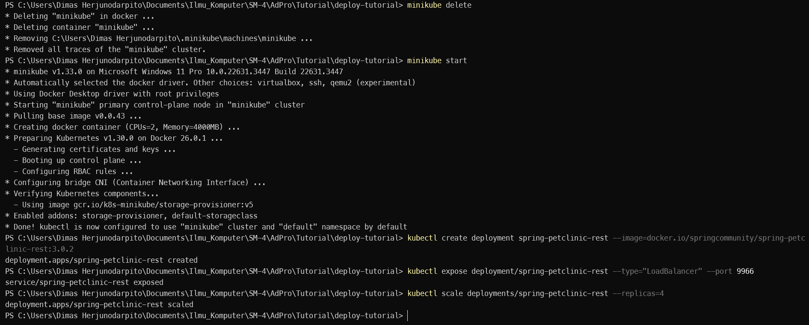
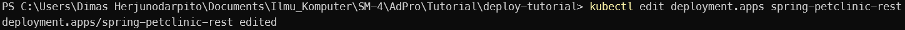
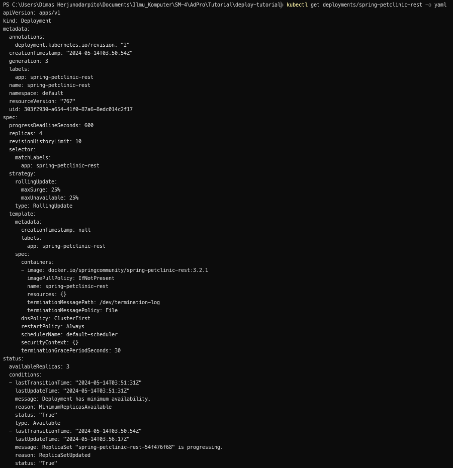
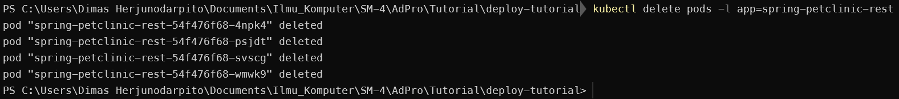
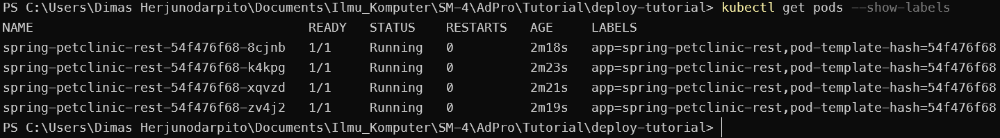
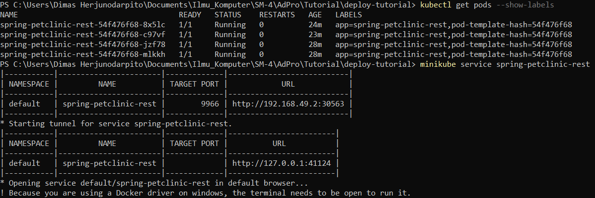
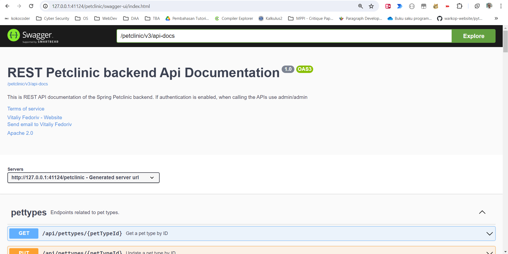
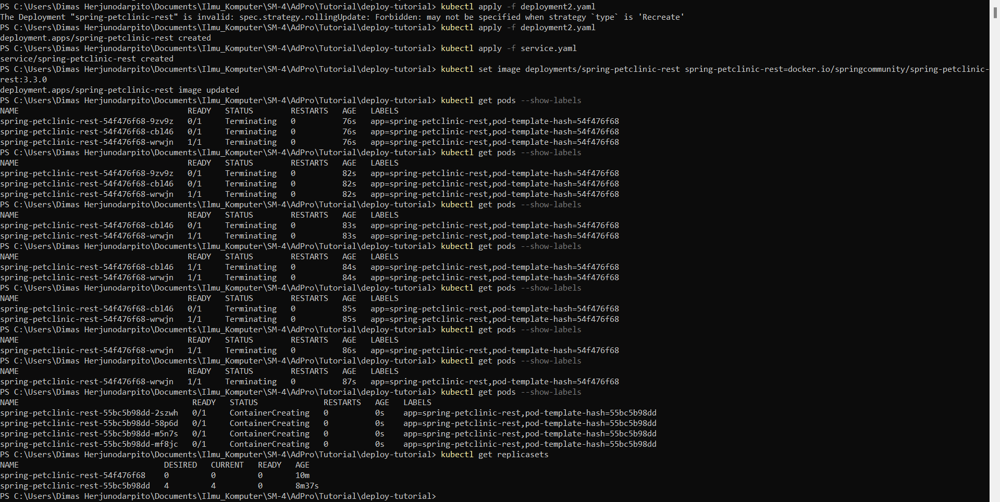

## Hello Minikube  
1. Compare the application logs before and after you exposed it as a Service.  
    Yes, there is a difference because after the service is exposed. The service can receive requests so that the log will record requests that have been made, for example as follows if refreshed many times against the hello-node service.  
      
2. Notice that there are two versions of `kubectl get` invocation during this tutorial section. The first does not have any option, while the latter has `-n` option with value set to `kube-system`.  
    The difference between the two syntaxes is that by using -n, we state that the service we want is from the namespace. This is needed if for example there are many different services that have the same name and are spread across many namespaces. By using -n, we focus the get on the namespace that we give after the -n query.  
  
## Rolling Update & Kubernetes Manifest File  
1. What is the difference between Rolling Update and Recreate deployment strategy?  
    The main difference between rolling update strategy and recreate deployment is that in recreate deployment there will be downtime between application updates because this strategy requires first deleting the previous application and then redeploying the new application. Therefore, there will be downtime after deletion and completion of deployment. Compared to rolling updates that change the application slowly to its latest version.  
2. Try deploying the Spring Petclinic REST using Recreate deployment strategy and document your attempt.  
    Reference: https://dev.to/cloudskills/kubernetes-deployment-strategy-recreate-3kgn  
      
    We will recreate springboot-petclinic-rest that has been scaled to version 3.0.2  
      
      
    After that, we will utilize the nature of the replicaset that will replace the deleted pod with its template, so it will replace the version of the template in the following settings.  
      
      
    To check the success of the changes perform the following query which will produce the output as shown in the image.  
      
      
    And when we delete our pod.  
      
      
    It can be seen that new pods are being made to replace them.  
      
      
    When run, it will appear like this.  
      
      
    So it can be declared successful.  
3. Prepare different manifest files for executing Recreate deployment strategy.  
    A file can be created as attached in github with the name deployment2.yaml. The contents of the file are the same as the export file in the tutorial but there are differences in the sections.  
    ```yaml
        selector:
            matchLabels:
            app: spring-petclinic-rest
        strategy:
            type: Recreate
    ```
    The file can be imported into Kubernetes like any other manifest file, then after that to prove that this manifest file is useful, we can change the image in the file to the version we want where it will delete pods in our old replica sets and then deploy new pods in new replicasets as shown below.  
      
      
    So it is evident that updates are done in a recreate strategy and not rolling.  
4. What do you think are the benefits of using Kubernetes manifest files?  
    The advantage of using manifest files is obviously efficiency. We no longer need to remember the procedures and syntax that we need to perform the first update or deployment. It's just like when we import files in docs. We don't need to know how the docs got that way, all that matters is that we now have a document that is ready to use. It also means that we reduce the possibility of human error because with the manifest file, the service created is definitely in accordance with the contents of the file and avoids programmer errors when typing the syntax one by one.  