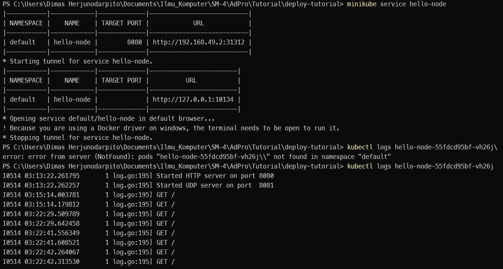

## Hello Minikube  
1. Compare the application logs before and after you exposed it as a Service.  
    Yes, there is a difference because after the service is exposed. The service can receive requests so that the log will record requests that have been made, for example as follows if refreshed many times against the hello-node service.  
      
2. Notice that there are two versions of `kubectl get` invocation during this tutorial section. The first does not have any option, while the latter has `-n` option with value set to `kube-system`.  
    The difference between the two syntaxes is that by using -n, we state that the service we want is from the namespace. This is needed if for example there are many different services that have the same name and are spread across many namespaces. By using -n, we focus the get on the namespace that we give after the -n query.  

